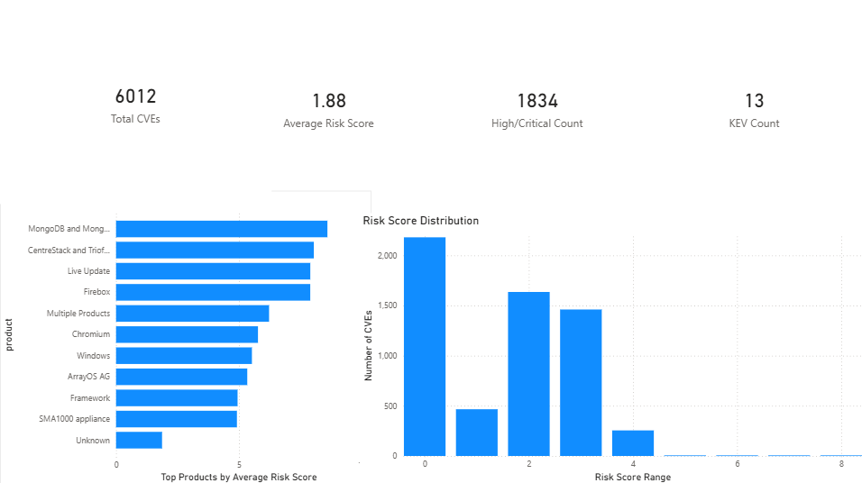
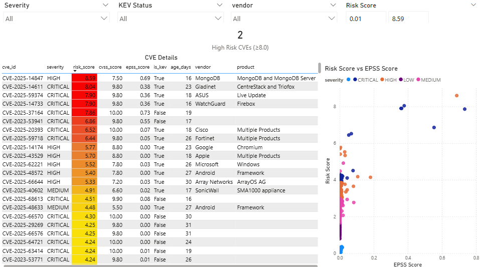
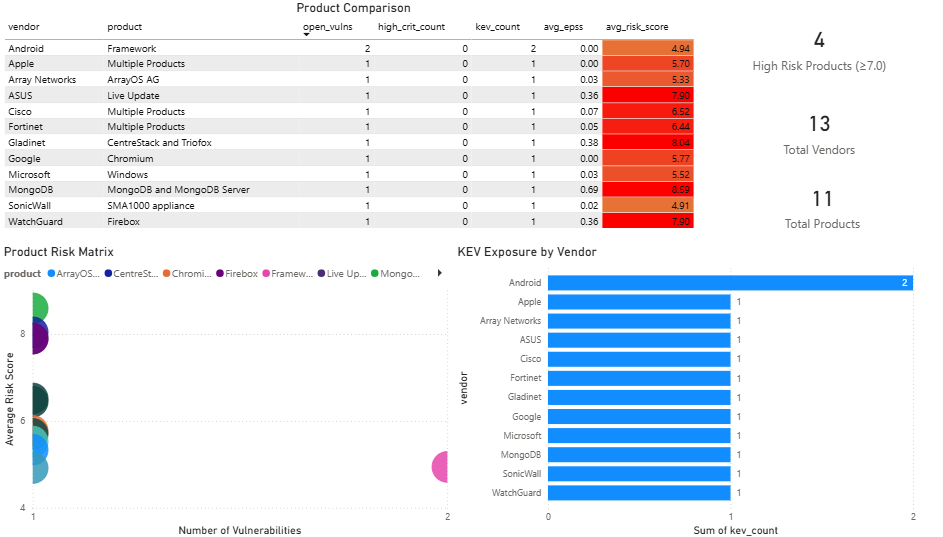
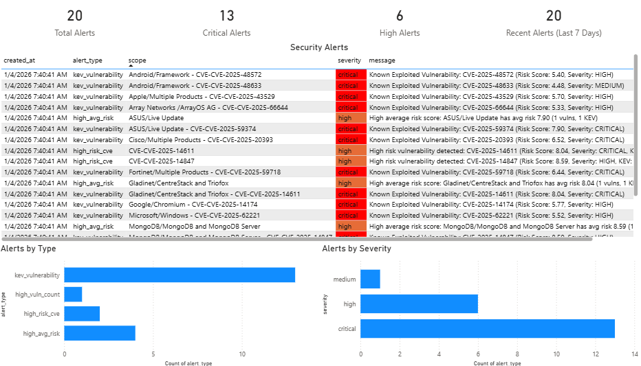
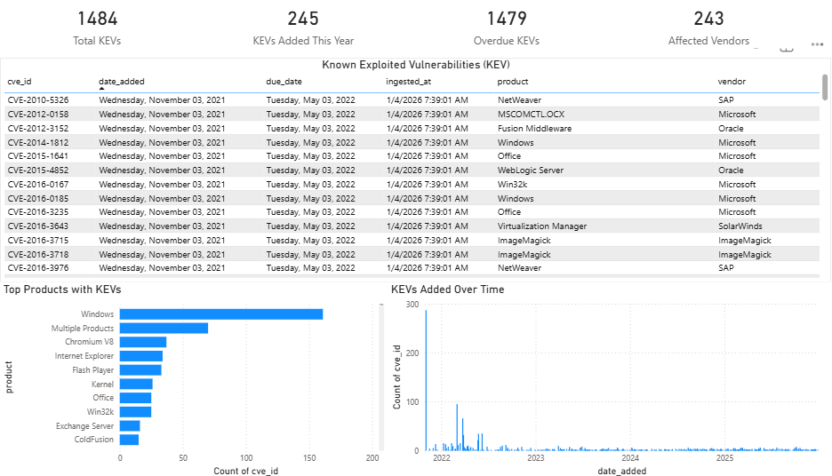

# Vulnerability Management Pipeline

## Overview

This project provides a comprehensive pipeline for ingesting, processing, and reporting on vulnerability data from multiple sources including:
- **CVE** (Common Vulnerabilities and Exposures) from NVD
- **KEV** (Known Exploited Vulnerabilities) from CISA
- **EPSS** (Exploit Prediction Scoring System) scores

The pipeline processes this data, computes risk scores, generates daily reports, and creates alerts for high-risk vulnerabilities.

## Data Sources & Metrics

### Data Sources

- **CVE (Common Vulnerabilities and Exposures)**: Standardized identifiers for publicly known cybersecurity vulnerabilities from the National Vulnerability Database (NVD). Each CVE includes severity ratings (CVSS scores), descriptions, and affected products.

- **KEV (Known Exploited Vulnerabilities)**: CISA's catalog of vulnerabilities that are actively being exploited in the wild. These require immediate remediation and are assigned due dates for patching.

- **EPSS (Exploit Prediction Scoring System)**: A machine learning model that predicts the likelihood (0.0 to 1.0) that a vulnerability will be exploited in the next 30 days. Higher scores indicate greater exploitation risk.

### Key Metrics Explained

- **Risk Score**: Composite score (0-10) combining CVSS, KEV status, EPSS, and vulnerability age. Higher scores indicate higher priority for remediation.
  - Formula: `(CVSS × 0.4) + (KEV bonus: +2.0) + (EPSS × 5.0) + (Age in days × 0.01)`
  - Thresholds: ≥8.0 = Critical Risk, ≥6.0 = High Risk, ≥4.0 = Medium Risk

- **CVSS Score**: Base severity score (0-10) from NVD indicating vulnerability severity. Higher scores mean more severe vulnerabilities.

- **EPSS Score**: Probability (0.0-1.0) that a vulnerability will be exploited. Scores ≥0.75 are considered high risk.

- **KEV Status**: Boolean indicating if a vulnerability is in CISA's Known Exploited Vulnerabilities catalog. All KEVs require immediate attention.

- **Age (days)**: Number of days since the vulnerability was published. Older vulnerabilities may have patches available.

- **Severity**: Categorical rating (Critical, High, Medium, Low) based on CVSS scores.

## Dashboard

The project includes a comprehensive **Power BI Dashboard** with 5 interactive pages for visualizing and analyzing vulnerability data:

### Page 1: Overview Dashboard
Executive summary with high-level KPIs and key visualizations:
- **4 KPI Cards**: Total CVEs, Average Risk Score, High/Critical Count, KEV Count
- **Top Products by Average Risk Score**: Horizontal bar chart showing highest-risk products
- **Risk Score Distribution**: Histogram showing vulnerability distribution across risk ranges



### Page 2: CVE Details
Detailed vulnerability analysis with advanced filtering:
- **Interactive Filters**: Severity, KEV Status, Vendor, Risk Score range
- **High Risk CVEs Counter**: Count of CVEs with risk score ≥ 8.0
- **Detailed CVE Table**: Complete vulnerability information with color-coded risk scores
  - CVE ID, Severity, Risk Score, CVSS Score, EPSS Score
  - KEV Status, Age (days), Vendor, Product
- **Risk Score vs EPSS Score Scatter Plot**: Correlation analysis with severity color coding



### Page 3: Product Analysis
Product-level risk assessment and comparison:
- **Product Comparison Table**: Comprehensive metrics per vendor/product
  - Open vulnerabilities, High/Critical count, KEV count
  - Average EPSS, Average Risk Score (color-coded)
- **3 KPI Cards**: High Risk Products (≥7.0), Total Vendors, Total Products
- **Product Risk Matrix**: Scatter plot showing risk vs vulnerability count
- **KEV Exposure by Vendor**: Horizontal bar chart showing KEV distribution



### Page 4: Alerts Dashboard
Real-time alert monitoring and analysis:
- **4 KPI Cards**: Total Alerts, Critical Alerts, High Alerts, Recent Alerts (Last 7 Days)
- **Security Alerts Table**: Complete alert details with severity color coding
  - Created timestamp, Alert type, Scope, Severity, Message
- **Alerts by Type Chart**: Distribution of alert types
- **Alerts by Severity Chart**: Severity breakdown visualization

**Alert Types:**
- `kev_vulnerability`: Known Exploited Vulnerabilities (Critical)
- `high_risk_cve`: CVEs with risk score ≥ 8.0 (High)
- `high_epss`: CVEs with EPSS ≥ 0.75 (Medium)
- `high_vuln_count`: Products with ≥ 50 vulnerabilities (Medium)
- `high_avg_risk`: Products with avg risk ≥ 7.0 (High)



### Page 5: KEV Details
Comprehensive Known Exploited Vulnerabilities tracking:
- **4 KPI Cards**: Total KEVs, KEVs Added This Year, Overdue KEVs, Affected Vendors
- **KEV Details Table**: Complete KEV information
  - CVE ID, Date Added, Due Date, Vendor, Product
- **Top Products with KEVs**: Horizontal bar chart showing most affected products
- **KEVs Added Over Time**: Time series showing KEV catalog growth



### Dashboard Features
- **Interactive Filtering**: Cross-page filtering, date-based analysis, severity/risk filtering
- **Color Coding**: Risk scores and severity levels visually distinguished
- **Live Data**: Connects to database for real-time updates
- **Export Ready**: CSV export script included for easy Power BI import

See `docs/powerbi.md` for detailed setup instructions.

## Installation

1. **Clone the repository** (if applicable) or navigate to the project directory

2. **Create a virtual environment:**
   ```bash
   python -m venv venv
   source venv/bin/activate  # On Windows: venv\Scripts\activate
   ```

3. **Install dependencies:**
   ```bash
   pip install -r requirements.txt
   ```

4. **Configure database connection:**
   - Copy `.env.example` to `.env` (if it exists) or create a `.env` file
   - Set the following environment variables:
     ```
     DB_HOST=your-database-host
     DB_PORT=5432
     DB_NAME=your-database-name
     DB_USER=your-database-user
     DB_PASSWORD=your-database-password
     ```
   - Or edit `config.py` directly with your database credentials

## Usage

### Run Full Pipeline

Run the complete pipeline (ingestion, reports, alerts):
```bash
python run.py
```

### Run Individual Steps

Run specific pipeline steps:
```bash
# Ingest KEV data
python run.py --step ingest_kev

# Ingest EPSS data
python run.py --step ingest_epss

# Ingest CVE data
python run.py --step ingest_cve

# Build reports
python run.py --step build_reports

# Run alerts
python run.py --step alerts
```

## Configuration

The pipeline uses `config.py` for database configuration. You can either:
- Set environment variables (DB_HOST, DB_PORT, DB_NAME, DB_USER, DB_PASSWORD)
- Edit `config.py` directly

## Pipeline Components

### 1. Data Ingestion (`pipelines/ingest_*.py`)

- **KEV Ingestion** (`ingest_kev.py`): Fetches Known Exploited Vulnerabilities from CISA
- **EPSS Ingestion** (`ingest_epss.py`): Downloads EPSS scores (300K+ records)
- **CVE Ingestion** (`ingest_cve.py`): Fetches recent CVEs from NVD API (last 30 days)

### 2. Risk Scoring (`pipelines/scoring.py`)

Computes composite risk scores based on:
- CVSS score (weight: 0.4)
- KEV status (bonus: 2.0)
- EPSS score (weight: 5.0)
- Vulnerability age (weight: 0.01 per day, capped at 365 days)

### 3. Report Generation (`pipelines/build_reports.py`)

Generates daily reports:
- **CVE Daily Report** (`report_cve_daily`): Individual CVE records with risk scores
- **Product Daily Report** (`report_product_daily`): Aggregated metrics by vendor/product

### 4. Alerting System (`pipelines/alerting.py`)

Generates alerts for:
- High risk score CVEs (risk_score >= 8.0)
- KEV vulnerabilities (all known exploited)
- High EPSS scores (EPSS >= 0.75)
- Products with high vulnerability counts (>= 50)
- Products with high average risk scores (>= 7.0)

## Database Schema

### Raw Data Tables
- `raw_cve`: CVE data from NVD
- `raw_kev`: Known Exploited Vulnerabilities
- `raw_epss`: EPSS scores with dates

### Report Tables
- `report_cve_daily`: Daily CVE snapshots with risk scores
- `report_product_daily`: Aggregated metrics by vendor/product

### Alert Table
- `alerts`: Generated alerts with severity and metrics

See `sql/01_create_tables.sql` for complete schema definitions.

## Reports

Reports are generated daily and stored in the database. Key metrics include:
- Open vulnerabilities count
- High/Critical severity count
- KEV count
- Average EPSS scores
- Average risk scores

### Exporting Reports

You can export reports to CSV for Power BI or other tools:

```python
from pipelines.db import fetch_df
import pandas as pd

# Export product reports
df = fetch_df("SELECT * FROM report_product_daily WHERE as_of_date = CURRENT_DATE")
df.to_csv('product_reports.csv', index=False)

# Export CVE reports
df = fetch_df("SELECT * FROM report_cve_daily WHERE as_of_date = CURRENT_DATE")
df.to_csv('cve_reports.csv', index=False)

# Export alerts
df = fetch_df("SELECT * FROM alerts WHERE DATE(created_at) = CURRENT_DATE")
df.to_csv('alerts.csv', index=False)
```

## Alerting

The alerting system automatically generates alerts for high-risk situations. Alerts are stored in the `alerts` table and can be:
- Viewed in the database
- Exported to CSV
- Integrated with notification systems

### Alert Types

1. **high_risk_cve**: CVEs with risk scores >= 8.0
2. **kev_vulnerability**: All vulnerabilities in CISA KEV catalog
3. **high_epss**: CVEs with EPSS scores >= 0.75
4. **high_vuln_count**: Products with >= 50 vulnerabilities
5. **high_avg_risk**: Products with average risk scores >= 7.0

### Viewing Alerts

```sql
SELECT * FROM alerts 
WHERE DATE(created_at) = CURRENT_DATE 
ORDER BY severity DESC, created_at DESC;
```

## Performance

- **EPSS Ingestion**: Processes ~309,000 records (takes 1-2 minutes with bulk operations)
- **CVE Ingestion**: Fetches last 30 days from NVD API
- **Report Building**: Optimized with bulk operations for fast processing
- **Alerting**: Generates alerts based on configurable thresholds

## Documentation

Additional documentation:
- `docs/kpis.md`: Key Performance Indicators
- `docs/scoring.md`: Risk scoring methodology
- `docs/powerbi.md`: Power BI integration guide

## Troubleshooting

### Common Issues

1. **Database Connection Errors**: Verify database credentials in `config.py` or environment variables
2. **EPSS Ingestion Slow**: This is normal for 300K+ records. The bulk operation should complete in 1-2 minutes
3. **NULL Constraint Violations**: Ensure all required fields are populated (vendor/product use 'Unknown' for non-KEV CVEs)
4. **Decimal Type Errors**: The scoring system handles PostgreSQL Decimal types automatically
